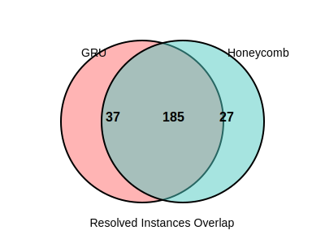
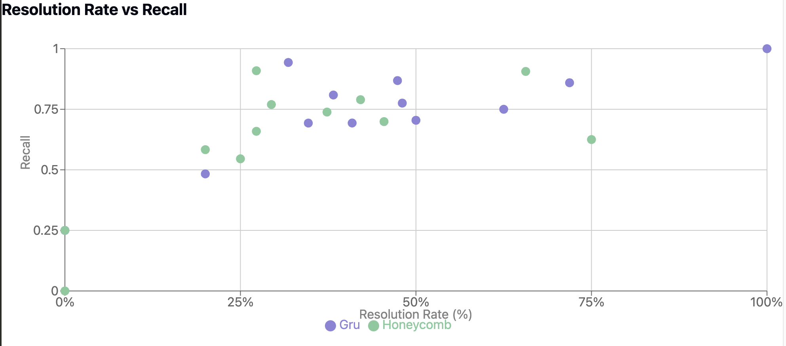
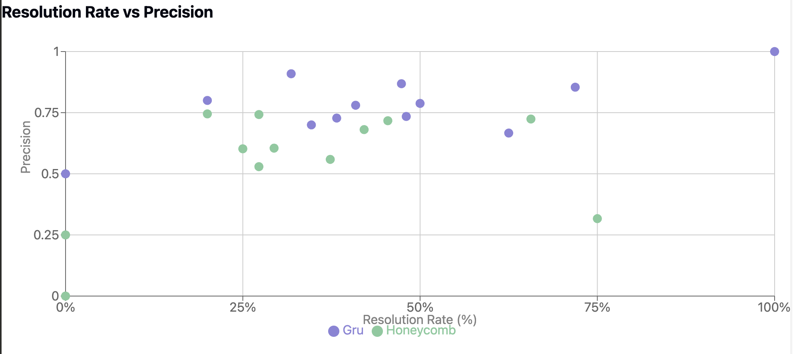

# Retrieval Analysis

## Verified Dataset

### Gru

```bash
python eval_retrieval.py --preds_path=submissions/verified/20240824_gru/all_preds.jsonl
```

| Repo | Precision | Recall | Count | Precision (All) | Recall (All) | Count (All) | Missing |
|--------------|-----------|--------|-------|-----------------|--------------|-------------|---------|
| astropy | 0.9091 | 0.9432 | 22 | 0.9091 | 0.9432 | 22 | 0 |
| django | 0.7346 | 0.7754 | 231 | 0.7346 | 0.7754 | 231 | 0 |
| matplotlib | 0.7279 | 0.8088 | 34 | 0.7279 | 0.8088 | 34 | 0 |
| mwaskom | 0.5 | 0.25 | 2 | 0.5 | 0.25 | 2 | 0 |
| pallets | 1 | 1 | 1 | 1 | 1 | 1 | 0 |
| psf | 0.6667 | 0.75 | 8 | 0.6667 | 0.75 | 8 | 0 |
| pydata | 0.7879 | 0.7045 | 22 | 0.7879 | 0.7045 | 22 | 0 |
| pylint-dev | 0.8 | 0.4833 | 10 | 0.8 | 0.4833 | 10 | 0 |
| pytest-dev | 0.8684 | 0.8684 | 19 | 0.8684 | 0.8684 | 19 | 0 |
| scikit-learn | 0.8542 | 0.8594 | 32 | 0.8542 | 0.8594 | 32 | 0 |
| sphinx-doc | 0.7803 | 0.6932 | 44 | 0.7803 | 0.6932 | 44 | 0 |
| sympy | 0.7 | 0.693 | 75 | 0.7 | 0.693 | 75 | 0 |
| OVERALL | 0.7555 | 0.7634 | 500 | 0.7555 | 0.7634 | 500 | 0 |

### Honeycomb

```
python eval_retrieval.py --preds_path=submissions/verified/20240820_honeycomb/all_preds.jsonl
```

| Repo | Precision | Recall | Count | Precision (All) | Recall (All) | Count (All) | Missing |
|--------------|-----------|--------|-------|-----------------|--------------|-------------|---------|
| astropy | 0.7778 | 0.9524 | 21 | 0.7424 | 0.9091 | 22 | 1 |
| django | 0.7202 | 0.7021 | 230 | 0.7171 | 0.6991 | 231 | 1 |
| matplotlib | 0.6049 | 0.7696 | 34 | 0.6049 | 0.7696 | 34 | 0 |
| mwaskom | 0.25 | 0.25 | 2 | 0.25 | 0.25 | 2 | 0 |
| pallets | 0 | 0 | 0 | 0 | 0 | 1 | 1 |
| psf | 0.3167 | 0.625 | 8 | 0.3167 | 0.625 | 8 | 0 |
| pydata | 0.5821 | 0.725 | 20 | 0.5292 | 0.6591 | 22 | 2 |
| pylint-dev | 0.745 | 0.5833 | 10 | 0.745 | 0.5833 | 10 | 0 |
| pytest-dev | 0.6808 | 0.7895 | 19 | 0.6808 | 0.7895 | 19 | 0 |
| scikit-learn | 0.724 | 0.9062 | 32 | 0.724 | 0.9062 | 32 | 0 |
| sphinx-doc | 0.6023 | 0.5455 | 44 | 0.6023 | 0.5455 | 44 | 0 |
| sympy | 0.5742 | 0.7586 | 73 | 0.5589 | 0.7384 | 75 | 2 |
| OVERALL | 0.6677 | 0.7239 | 493 | 0.6584 | 0.7137 | 500 | 7 |

### Merged

| Repo | Gru | | | | | Honeycomb | | | | |
|--------------|---------|--------|--------|----------|-----------|-----------|--------|--------|----------|-----------|
| | Prec. | Recall | Count | Resolved | Res. Rate | Prec. | Recall | Count | Resolved | Res. Rate |
| astropy | 0.9091 | 0.9432 | 22 | 7 | 31.82% | 0.7424 | 0.9091 | 22 | 6 | 27.27% |
| django | 0.7346 | 0.7754 | 231 | 111 | 48.05% | 0.7171 | 0.6991 | 231 | 105 | 45.45% |
| matplotlib | 0.7279 | 0.8088 | 34 | 13 | 38.24% | 0.6049 | 0.7696 | 34 | 10 | 29.41% |
| mwaskom | 0.5000 | 0.2500 | 2 | 0 | 0.00% | 0.2500 | 0.2500 | 2 | 0 | 0.00% |
| pallets | 1.0000 | 1.0000 | 1 | 1 | 100.00% | 0.0000 | 0.0000 | 1 | 0 | 0.00% |
| psf | 0.6667 | 0.7500 | 8 | 5 | 62.50% | 0.3167 | 0.6250 | 8 | 6 | 75.00% |
| pydata | 0.7879 | 0.7045 | 22 | 11 | 50.00% | 0.5292 | 0.6591 | 22 | 6 | 27.27% |
| pylint-dev | 0.8000 | 0.4833 | 10 | 2 | 20.00% | 0.7450 | 0.5833 | 10 | 2 | 20.00% |
| pytest-dev | 0.8684 | 0.8684 | 19 | 9 | 47.37% | 0.6808 | 0.7895 | 19 | 8 | 42.11% |
| scikit-learn | 0.8542 | 0.8594 | 32 | 23 | 71.88% | 0.7240 | 0.9062 | 32 | 21 | 65.63% |
| sphinx-doc | 0.7803 | 0.6932 | 44 | 18 | 40.91% | 0.6023 | 0.5455 | 44 | 11 | 25.00% |
| sympy | 0.7000 | 0.6930 | 75 | 26 | 34.67% | 0.5589 | 0.7384 | 75 | 28 | 37.33% |
| OVERALL | 0.7555 | 0.7634 | 500 | 226 | 45.20% | 0.6584 | 0.7137 | 500 | 203 | 40.60% |


### Venn Diagram: GRU vs Honeycomb Resolved Instances



The Venn diagram above illustrates the overlap of resolved instances between the GRU and Honeycomb models. GRU resolved 37 unique instances, Honeycomb resolved 27 unique instances, and there was an overlap of 185 instances resolved by both models.


### Resolution Rate vs Precision and Recall

To visualize the relationship between resolution rate and model performance, we've created two scatter plots:




These plots show how the resolution rate for each repository correlates with the model's precision and recall. This can help identify any patterns or trends in model performance across different resolution rates.


## Full Dataset

### Honeycomb

| Repo | Precision | Recall | Count | Precision (All) | Recall (All) | Count (All) | Missing | Resolved | Res. Rate |
|--------------|-----------|--------|-------|-----------------|--------------|-------------|---------|----------|-----------|
| astropy | 0.6625 | 0.7022 | 91 | 0.6346 | 0.6727 | 95 | 4 | 18 | 18.95% |
| django | 0.6873 | 0.6397 | 840 | 0.6793 | 0.6322 | 850 | 10 | 238 | 28.00% |
| matplotlib | 0.6451 | 0.6496 | 182 | 0.6380 | 0.6425 | 184 | 2 | 26 | 14.13% |
| mwaskom | 0.6212 | 0.4091 | 22 | 0.6212 | 0.4091 | 22 | 0 | 1 | 4.55% |
| pallets | 0.5762 | 0.8667 | 10 | 0.5238 | 0.7879 | 11 | 1 | 2 | 18.18% |
| psf | 0.5083 | 0.5606 | 44 | 0.5083 | 0.5606 | 44 | 0 | 23 | 52.27% |
| pydata | 0.6473 | 0.5893 | 100 | 0.5884 | 0.5358 | 110 | 10 | 16 | 14.55% |
| pylint-dev | 0.5930 | 0.4527 | 55 | 0.5722 | 0.4368 | 57 | 2 | 5 | 8.77% |
| pytest-dev | 0.6408 | 0.5651 | 117 | 0.6300 | 0.5556 | 119 | 2 | 23 | 19.33% |
| scikit-learn | 0.7404 | 0.7429 | 220 | 0.7113 | 0.7137 | 229 | 9 | 50 | 21.83% |
| sphinx-doc | 0.6304 | 0.4688 | 179 | 0.6035 | 0.4488 | 187 | 8 | 27 | 14.44% |
| sympy | 0.6250 | 0.6572 | 376 | 0.6088 | 0.6402 | 386 | 10 | 77 | 19.95% |
| OVERALL | 0.6619 | 0.6289 | 2236 | 0.6451 | 0.6130 | 2294 | 58 | 506 | 22.06% |